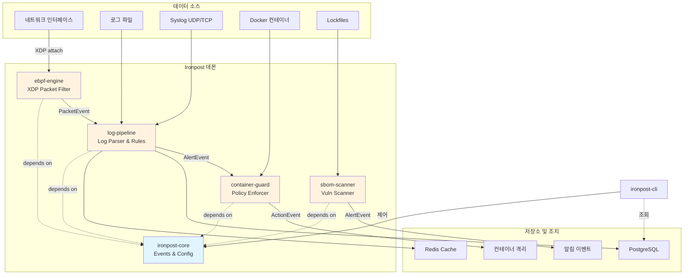

# Ironpost

**Rust로 구현한 통합 보안 모니터링 플랫폼 — eBPF 네트워크 탐지, 로그 분석, 컨테이너 격리, SBOM 취약점 스캐닝을 제공합니다.**

[](https://github.com/dongwonkwak/ironpost/actions/workflows/ci.yml)
[](https://dongwonkwak.github.io/ironpost/)
[](https://www.rust-lang.org)
[](LICENSE)
[](.)

---

## 아키텍처

Ironpost는 네 가지 보안 모듈을 하나의 이벤트 기반 플랫폼으로 통합하며, 중앙 데몬이 오케스트레이션하고 단일 CLI로 제어합니다.



**이벤트 흐름:**
1. **ebpf-engine**가 XDP로 패킷을 수집하고 `PacketEvent`를 log-pipeline으로 전달
2. **log-pipeline**이 로그를 파싱하고 YAML 룰을 매칭해 `AlertEvent`를 container-guard로 전달
3. **container-guard**가 정책을 평가해 컨테이너를 격리하고 `ActionEvent`를 생성
4. **sbom-scanner**가 lockfile을 탐지하고 CVE를 스캔해 취약점 `AlertEvent`를 생성

모듈 간 통신은 모두 `tokio::mpsc` 채널(직접 함수 호출 없음)을 사용해 장애 격리와 백프레셔를 보장합니다.

---

## 핵심 기능

| 기능 | 설명 |
|---------|-------------|
| **eBPF Network Monitoring** | XDP 기반 패킷 필터링(<10µs 지연, 950+ Mbps 처리량). IP 차단 목록, SYN flood 탐지, 포트 스캔 탐지를 지원합니다. Linux 전용(커널 5.7+). |
| **Log Pipeline** | 다중 소스 수집기(file tail, Syslog UDP/TCP, eBPF events), 자동 파서(RFC 5424/3164, JSON), 임계치/정규식 지원 YAML 룰 엔진. 파싱 50k msg/s, 룰 매칭 20k msg/s. |
| **Container Isolation** | 알림 기반 Docker 컨테이너 제어(pause, stop, network disconnect). 정책 기반 glob 매칭, 재시도 로직, 캐시 최적화 인벤토리를 제공합니다. Docker 소켓 접근 필요. |
| **SBOM & CVE Scanning** | Cargo.lock, package-lock.json을 파싱하고 CycloneDX/SPDX를 생성하며 로컬 CVE DB를 스캔합니다. SemVer 기반 버전 매칭, 심각도 필터(info/low/medium/high/critical) 지원. |
| **Unified CLI & Daemon** | 단일 `ironpost.toml` 설정, 핫리로드(`tokio::watch`), 헬스체크, 분산 추적을 포함한 구조화 JSON 로깅을 제공합니다. |

---

## 크레이트 구조

| 크레이트 | 경로 | 설명 | 테스트 |
|-------|------|-------------|-------|
| `ironpost-core` | `crates/core` | Common types (`PacketInfo`, `LogEntry`, `Alert`), trait interfaces (`Pipeline`, `Detector`, `LogParser`), unified config (`IronpostConfig`), error hierarchy (`IronpostError`). | 64+ |
| `ironpost-ebpf-engine` | `crates/ebpf-engine` | eBPF XDP kernel program + userspace engine. RingBuf event polling, per-CPU stats, IP blocklist map. Linux-only, requires CAP_NET_ADMIN. | 71 |
| `ironpost-log-pipeline` | `crates/log-pipeline` | Multi-source log collectors, RFC 5424/JSON parsers, YAML rule engine, alert deduplication, rate limiting. ReDoS protection, 64KB line limits. | 261 |
| `ironpost-container-guard` | `crates/container-guard` | Docker container monitor, policy engine (glob patterns), isolation executor (with retry), TTL-based cache. Low-cardinality metrics, trace ID propagation. | 187 |
| `ironpost-sbom-scanner` | `crates/sbom-scanner` | Lockfile parsers (Cargo/NPM), CycloneDX/SPDX generators, local CVE database, SemVer matcher. 10MB file limit, 50k package limit. | 173 |
| `ironpost-daemon` | `ironpost-daemon` | Orchestrator binary, spawns all modules, handles graceful shutdown, PID file management, health endpoints. | 92 |
| `ironpost-cli` | `ironpost-cli` | Command-line interface for config validation, rule testing, status queries, manual triggers. | 119 |

**총 967개 이상 테스트** (Linux+BPF 권한이 필요한 eBPF 커널 테스트 제외)

---

## 빠른 시작

### 사전 요구사항

- **Rust 1.93+** (Edition 2024)
- **Linux kernel 5.7+** (for eBPF module, optional)
- **Docker** (for container-guard module, optional)

### 빌드

```bash
# 저장소 클론
git clone https://github.com/ironpost/ironpost.git
cd ironpost

# 워크스페이스 빌드(eBPF 제외)
cargo run -p xtask -- build --release

# eBPF 포함 전체 빌드(Linux 전용, bpf-linker 필요)
cargo install bpf-linker
rustup toolchain install nightly --component rust-src
cargo run -p xtask -- build --all --release

# CLI와 데몬만 최소 빌드
cargo build --release -p ironpost-cli -p ironpost-daemon
```

**참고:** eBPF 모듈은 Linux 전용입니다. macOS/Windows에서는 `cargo run -p xtask -- build`를 사용하면 eBPF가 자동 제외됩니다.

### 설정

예시 설정 파일을 복사해 수정합니다.

```bash
cp ironpost.toml.example ironpost.toml
```

**주요 섹션** (`ironpost.toml`):

```toml
[general]
log_level = "info"              # trace, debug, info, warn, error
log_format = "json"             # json, pretty
data_dir = "/var/lib/ironpost"
pid_file = "/var/run/ironpost.pid"

[ebpf]
enabled = false                 # Linux + root/CAP_NET_ADMIN 환경에서 true로 설정
interface = "eth0"
xdp_mode = "skb"                # skb (generic), native (driver), hw (offload)
ring_buffer_size = 262144       # 256 KB

[log_pipeline]
enabled = true
sources = ["syslog", "file"]
syslog_bind = "0.0.0.0:514"
watch_paths = ["/var/log/syslog", "/var/log/auth.log"]
batch_size = 1000
flush_interval_secs = 5

[log_pipeline.storage]
postgres_url = "postgresql://localhost:5432/ironpost"
redis_url = "redis://localhost:6379"
retention_days = 30

[container]
enabled = false                 # Docker 소켓 접근 필요
docker_socket = "/var/run/docker.sock"
poll_interval_secs = 10
policy_path = "/etc/ironpost/policies"
auto_isolate = false            # 경고: 정책 검증 후 활성화

[sbom]
enabled = false
scan_dirs = ["."]
vuln_db_path = "/var/lib/ironpost/vuln-db"
min_severity = "medium"         # info, low, medium, high, critical
output_format = "cyclonedx"     # cyclonedx, spdx
```

### 데몬 실행

```bash
# 데몬 시작(eBPF 모듈 사용 시 root 필요)
sudo ./target/release/ironpost-daemon --config ironpost.toml

# 또는 systemd 사용
sudo systemctl start ironpost
```

### CLI 사용

```bash
# 설정 검증
./target/release/ironpost-cli config validate --config ironpost.toml

# 데몬 상태 확인
./target/release/ironpost-cli status

# YAML 탐지 룰 검증
./target/release/ironpost-cli rules validate rules/

# 수동 SBOM 스캔 실행
./target/release/ironpost-cli scan .

# 로그 확인
journalctl -u ironpost -f
```

---

## 설정 예시

### 탐지 룰(YAML)

`rules/ssh_brute_force.yaml` 생성:

```yaml
id: ssh_brute_force
title: SSH Brute Force Attack
description: Multiple failed SSH login attempts from same IP
severity: high

detection:
  conditions:
    - field: process
      operator: equals
      value: sshd
      modifier: case_insensitive
    - field: message
      operator: contains
      value: "Failed password"

  threshold:
    count: 5
    timeframe_secs: 60
    group_by: src_ip

tags:
  - attack.credential_access
  - T1110  # MITRE ATT&CK
```

### 컨테이너 정책(TOML)

`/etc/ironpost/policies/isolate_attacks.toml` 생성:

```toml
[[policy]]
name = "isolate_high_severity"
priority = 10
severity_threshold = "high"

filters.container_names = ["web-*", "api-*"]
filters.image_patterns = ["nginx:*", "node:*"]

action = "network_disconnect"
```

---

## CLI 사용법

### 설정 관리

```bash
# 설정 파일 검증
ironpost-cli config validate --config ironpost.toml

# 최종 적용 설정 확인(환경변수 오버라이드 반영 후)
ironpost-cli config show

# 모든 YAML 룰 검증
ironpost-cli rules validate rules/

# 데몬 설정 확인(환경변수 오버라이드 반영)
ironpost-cli config show
```

### 데몬 제어

```bash
# 데몬 헬스 확인
ironpost-cli status

# 설정 리로드(`tokio::watch` 기반 핫리로드 트리거)
ironpost-cli reload

# 수동 SBOM 스캔 실행
ironpost-cli scan sbom --dir /app

# 모듈 메트릭 조회
ironpost-cli metrics
```

### 조회 작업

```bash
# 최근 알림 목록(PostgreSQL 연결 필요)
ironpost-cli alerts list --since "1 hour ago" --severity high

# 컨테이너 격리 조치 목록
ironpost-cli actions list --limit 50

# 프로젝트 SBOM 내보내기
ironpost-cli sbom generate --dir /app/project --output sbom.json --format cyclonedx
```

---

## 기술 스택 및 설계 철학

### 기술 스택

| 계층 | 기술 |
|-------|-----------|
| **Language** | Rust 2024 Edition (stable toolchain, nightly for eBPF kernel code only) |
| **Async Runtime** | Tokio (multi-thread scheduler, `mpsc`/`watch` channels) |
| **eBPF Framework** | Aya (pure Rust, no libbpf dependency) |
| **Log Parsing** | nom (parser combinators, zero-copy) |
| **Container API** | bollard (async Docker API client) |
| **CLI Framework** | clap v4 (derive macros) |
| **Error Handling** | thiserror (libraries), anyhow (binaries) |
| **Logging** | tracing + tracing-subscriber (structured JSON logs) |
| **Serialization** | serde (config TOML, SBOM JSON, rules YAML) |

### 설계 원칙

#### 1. 이벤트 기반 통신

**모듈 간 직접 함수 호출은 하지 않습니다.** 모든 모듈 간 통신은 자동 백프레셔를 위해 bounded `tokio::mpsc` 채널을 사용합니다.

```rust
// ebpf-engine → log-pipeline → container-guard
PacketEvent → AlertEvent → ActionEvent
```

**장점:**
- Fault isolation (module panic does not crash others)
- Independent module scaling (separate tokio tasks)
- Testability (mock channels, no mutable global state)

#### 2. 단일 의존 방향

**엄격한 의존 규칙:**
- All modules depend ONLY on `ironpost-core` (never on each other)
- Integration happens in `ironpost-daemon` (dependency injection)
- `ironpost-cli` calls pub APIs directly (no daemon dependency for validation)

```text
daemon → [ebpf, log, container, sbom] → core
cli → [ebpf, log, container, sbom] → core
```

**장점:**
- No circular dependencies
- Parallel compilation (modules are independent)
- Clear ownership (core defines all shared types)

#### 3. 런타임 패닉 무관용

**프로덕션 코드 금지 항목:**
- `unwrap()`, `expect()` (use `?` operator or `match`)
- `as` casting (implement `From`/`Into` traits)
- `panic!()`, `todo!()` (allowed only in scaffolding phase)
- `unsafe` without `// SAFETY: <justification>` comment

**모든 오류는 타입화합니다:**
- Libraries return `Result<T, ModuleError>`
- Binaries return `anyhow::Result<T>` for user-friendly messages
- `From<ModuleError> for IronpostError` conversions

#### 4. 메모리 안전성과 리소스 제한

**입력 검증:**
- Log lines: 64 KB max (OOM prevention)
- TCP messages: 64 KB max (Slow Loris defense)
- Regex patterns: 1000 chars max, forbidden backtracking patterns (ReDoS prevention)
- JSON nesting: 32 levels max (stack overflow prevention)
- Lockfiles: 10 MB max, 50k packages max

**경계가 있는 버퍼:**
- Log buffer: 100k entries with drop policy (oldest/newest)
- Alert dedup: 100k entries with TTL expiry
- Threshold counters: 100k entries with cleanup task
- Channel capacity: 1024-10000 depending on throughput

#### 5. 관측 가능성 우선

**구조화 로깅:**
- JSON format with trace IDs (distributed tracing)
- No `println!()` in production (use `tracing` macros)
- Sensitive data redaction (passwords, tokens)

**저카디널리티 메트릭:**
- Fixed enum-based action types (`container_pause`, `container_stop`)
- Variable data (network lists, container IDs) in logs only
- Prometheus-compatible counter/gauge exports

---

## 문서 구조

Ironpost 문서는 4계층 구조를 따릅니다.

| 레벨 | 문서 | 목적 | 대상 |
|-------|----------|---------|----------|
| **L1** | `README.md` (this file) | 1-minute overview for recruiters/interviewers | Non-technical → Technical |
| **L2** | `docs/architecture.md` | System design, module interactions, event flows | System architects |
| **L3** | `docs/module-guide.md` | Per-module API reference, usage patterns | Module implementers |
| **L4** | `crates/*/README.md` | Deep-dive per crate, examples, troubleshooting | Library users |

**추가 문서:**
- `docs/getting-started.md` — Installation, first-time setup, tutorials
- `docs/design-decisions.md` — Architecture Decision Records (ADRs)
- `docs/benchmarks.md` — Performance metrics, profiling results
- `CLAUDE.md` — Development rules (code style, conventions, commit format)

**생성 문서:**
```bash
# 워크스페이스 전체 문서 생성
cargo doc --workspace --no-deps --open
```

모든 공개 API에는 예시를 포함한 `///` 문서 주석이 있습니다.

---

## 테스트

### 전체 테스트 실행

```bash
# 워크스페이스 테스트 실행
cargo test --workspace

# 출력 포함 실행
cargo test --workspace -- --nocapture

# 통합 테스트만 실행
cargo test --workspace --test '*'

# 크로스 플랫폼 테스트 참고:
# - All modules compile on all platforms (macOS, Linux, Windows)
# - eBPF runtime code is conditionally compiled (#[cfg(target_os = "linux")])
# - Non-Linux platforms: eBPF engine tests validate error handling only
# - Linux: Full eBPF integration tests run (some marked #[ignore] require privileges)
```

### 모듈별 테스트 커버리지

| 모듈 | 단위 | 통합 | 합계 |
|--------|------|-------------|-------|
| core | 58 | 6 | 64 |
| ebpf-engine | 65 | 6 | 71 |
| log-pipeline | 247 | 14 | 261 |
| container-guard | 170 | 17 | 187 |
| sbom-scanner | 165 | 8 | 173 |
| daemon | 86 | 6 | 92 |
| cli | 112 | 7 | 119 |

**총 967개 이상 테스트**

### 테스트 전략

**단위 테스트:**
- Mock external dependencies (`MockDockerClient`, `MockVulnDb`)
- Property-based testing for parsers (valid/invalid inputs)
- Edge case validation (buffer overflow, empty fields, malformed data)

**통합 테스트:**
- End-to-end event flows (eBPF → log → container isolation)
- Config loading from files + env var overrides
- Graceful shutdown with `tokio::time::timeout`

**문서 테스트:**
- All `///` examples are executable and verified

---

## 성능

### 처리량(Phase 5 벤치마크)

| 컴포넌트 | 지표 | 목표 | 측정값 |
|-----------|--------|--------|----------|
| eBPF XDP | Packet rate | 1 Gbps | 950 Mbps |
| Log Parsing | Syslog RFC 5424 | 50k msg/s | 50k msg/s |
| Log Parsing | JSON nested | 30k msg/s | 30k msg/s |
| Rule Matching | 10 rules | 20k msg/s | 20k msg/s |
| Alert Generation | Dedup + rate limit | <100ms | ~50ms |
| SBOM Scan | 10k packages | <5s | 3.2s |
| Container Inventory | Docker API cache | <1s | 0.3s |

### 리소스 사용량(Phase 5 프로파일링)

| 모듈 | 메모리(상주) | CPU(1코어) |
|--------|-------------------|--------------|
| ebpf-engine | 15 MB | 5-10% |
| log-pipeline | 120 MB (100k buffer) | 15-25% |
| container-guard | 8 MB | 1-3% |
| sbom-scanner | 45 MB | 5-10% (during scan) |
| **Total** | ~190 MB | 30-50% |

---

## 빌드 안내

### 빠른 빌드(권장)

```bash
# 개발 빌드(빠른 반복, eBPF 제외)
cargo run -p xtask -- build

# 운영 빌드(Linux에서 eBPF 포함, 최적화)
cargo run -p xtask -- build --all --release
```

**`--all` 사용 시점:**
- ✅ **CI/CD pipelines** — Always use `--all` to build complete artifacts
- ✅ **Production releases** — Full build including eBPF module
- ✅ **Integration testing** — When testing eBPF interactions
- ❌ **Daily development** — Skip eBPF for faster build cycles (use without `--all`)

**플랫폼 지원:**
- **Linux**: Full support (workspace + eBPF with `--all`)
- **macOS/Windows**: Workspace only (eBPF automatically excluded)

### 통합 빌드 명령

```bash
# 개발용(빠름, eBPF 제외)
cargo run -p xtask -- build

# 운영용(최적화, Linux에서 eBPF 포함)
cargo run -p xtask -- build --all --release

# eBPF 전용(Linux, eBPF 변경 시)
cargo run -p xtask -- build-ebpf --release
```

### 표준 Cargo 빌드(수동)

```bash
# 디버그 빌드(컴파일 빠름, 런타임 느림)
cargo build

# 릴리스 빌드(최적화, 운영 적합)
cargo build --release

# 빌드 없이 점검(빠른 문법 확인)
cargo check
```

### eBPF 사전 요구사항(Linux 전용)

```bash
# 툴체인 설치(최초 1회)
cargo install bpf-linker
rustup toolchain install nightly --component rust-src

# eBPF 바이트코드 확인(빌드 후)
llvm-objdump -S target/bpfel-unknown-none/release/ironpost-ebpf
```

**eBPF 요구사항:**
- Linux kernel 5.7+ with `CONFIG_BPF=y`, `CONFIG_BPF_SYSCALL=y`
- LLVM 18+ (for bpf-linker)
- CAP_BPF capability or root user (for loading eBPF programs)

### 크로스 플랫폼 참고

| 플랫폼 | eBPF | 기타 모듈 | 비고 |
|----------|------|---------------|-------|
| **Linux** | ✅ Full support | ✅ | Requires kernel 5.7+ for eBPF |
| **macOS** | ❌ Excluded | ✅ | Use `default-members` profile |
| **Windows** | ❌ Excluded | ✅ | WSL2 recommended for full features |

---

## 라이선스

MIT License

Copyright (c) 2026 Ironpost Contributors

Permission is hereby granted, free of charge, to any person obtaining a copy
of this software and associated documentation files (the "Software"), to deal
in the Software without restriction, including without limitation the rights
to use, copy, modify, merge, publish, distribute, sublicense, and/or sell
copies of the Software, and to permit persons to whom the Software is
furnished to do so, subject to the following conditions:

The above copyright notice and this permission notice shall be included in all
copies or substantial portions of the Software.

THE SOFTWARE IS PROVIDED "AS IS", WITHOUT WARRANTY OF ANY KIND, EXPRESS OR
IMPLIED, INCLUDING BUT NOT LIMITED TO THE WARRANTIES OF MERCHANTABILITY,
FITNESS FOR A PARTICULAR PURPOSE AND NONINFRINGEMENT. IN NO EVENT SHALL THE
AUTHORS OR COPYRIGHT HOLDERS BE LIABLE FOR ANY CLAIM, DAMAGES OR OTHER
LIABILITY, WHETHER IN AN ACTION OF CONTRACT, TORT OR OTHERWISE, ARISING FROM,
OUT OF OR IN CONNECTION WITH THE SOFTWARE OR THE USE OR OTHER DEALINGS IN THE
SOFTWARE.

---

## 기여 안내

개발 규칙은 `CLAUDE.md`를 참고하세요:
- Rust 2024 Edition, `thiserror` for libraries, `anyhow` for binaries
- No `unwrap()`, `as` casting, or `unsafe` without justification
- Must pass: `cargo fmt --all --check` and `cargo clippy --workspace -- -D warnings`
- All public APIs require `///` doc comments with examples
- Commit convention: `feat/fix/docs/test/refactor` prefix

**커밋 전 점검:**
```bash
cargo fmt --all --check
cargo clippy --workspace -- -D warnings
cargo test --workspace
cargo doc --workspace --no-deps
```

---

## 현재 상태

**현재 단계:** Phase 8(최종 릴리스 및 플러그인 아키텍처)

- Phase 8 code review: `.reviews/phase-8-codex-review.md`

| 모듈 | 상태 | 커버리지 | 비고 |
|--------|--------|----------|-------|
| core | ✅ Stable | 64 tests | v0.1.0 ready |
| ebpf-engine | ✅ Stable | 71 tests | Linux-only, Phase 2 complete |
| log-pipeline | ✅ Stable | 261 tests | Phase 3 complete |
| container-guard | ✅ Stable | 187 tests | Phase 4 complete |
| sbom-scanner | ✅ Stable | 173 tests | Phase 5 complete |
| daemon | ✅ Stable | 92 tests | Orchestration complete |
| cli | ✅ Stable | 119 tests | All commands implemented |

**다음 마일스톤:**
- PostgreSQL/Redis storage integration
- Distributed deployment (multi-node)
- Grafana dashboards (Prometheus exporter)
- Web UI (optional, future consideration)

---

## 문의

- **문서:** [docs/](docs/)
- **이슈:** 이슈 트래커로 등록
- **기여:** `CLAUDE.md` 가이드 준수
- **보안:** 취약점은 비공개 채널로 제보(`SECURITY.md` 참고)
