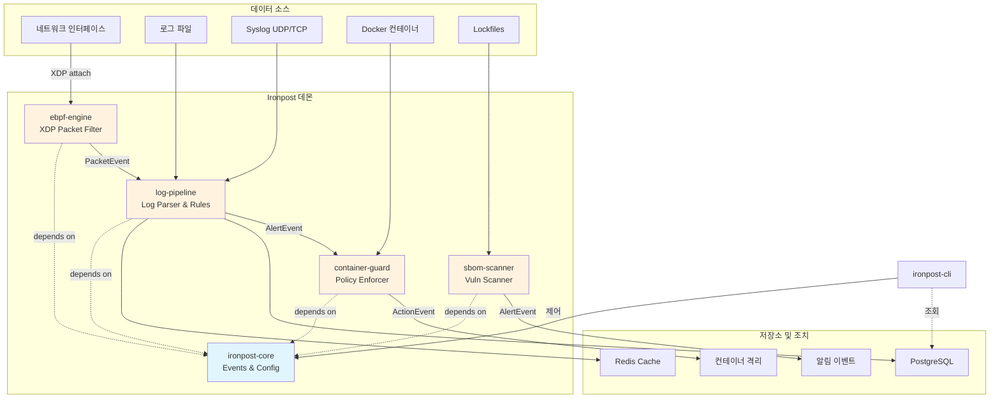

# Ironpost

**Rust로 구현한 통합 보안 모니터링 플랫폼 — eBPF 네트워크 탐지, 로그 분석, 컨테이너 격리, SBOM 취약점 스캐닝을 제공합니다.**

[](https://github.com/dongwonkwak/ironpost/actions/workflows/ci.yml)
[](https://dongwonkwak.github.io/ironpost/)
[](https://www.rust-lang.org)
[](LICENSE)

---

## 데모


> Docker 환경에서 3분 만에 체험할 수 있습니다. → [데모 가이드](docs/demo.md)

---

## 핵심 기능

| 기능 | 설명 |
|------|------|
| **eBPF 네트워크 모니터링** | XDP 기반 패킷 필터링, 950+ Mbps 처리량. Linux 5.7+ 전용 |
| **로그 파이프라인** | Syslog/JSON 파싱(50k msg/s), YAML 룰 엔진으로 위협 탐지 |
| **컨테이너 격리** | 알림 기반 Docker 컨테이너 자동 격리(pause/stop/network disconnect) |
| **SBOM & CVE 스캐닝** | Cargo.lock/package-lock.json 파싱, CycloneDX/SPDX 생성, 로컬 CVE 스캔 |
| **Prometheus 메트릭 + Grafana** | 29개 메트릭 노출, 3개 대시보드 (Overview, Log Pipeline, Security) |
| **통합 CLI & 데몬** | 단일 ironpost.toml 설정, 핫리로드, 구조화 JSON 로깅 |

---

## 아키텍처

Ironpost는 네 가지 보안 모듈을 하나의 이벤트 기반 플랫폼으로 통합합니다.



**이벤트 흐름:**
1. **ebpf-engine**가 XDP로 패킷을 수집하고 `PacketEvent`를 log-pipeline으로 전달
2. **log-pipeline**이 로그를 파싱하고 YAML 룰을 매칭해 `AlertEvent`를 container-guard로 전달
3. **container-guard**가 정책을 평가해 컨테이너를 격리하고 `ActionEvent`를 생성
4. **sbom-scanner**가 lockfile을 탐지하고 CVE를 스캔해 취약점 `AlertEvent`를 생성

모듈 간 통신은 bounded `tokio::mpsc` 채널을 사용합니다. 상세 아키텍처는 [docs/architecture.md](docs/architecture.md)를 참고하세요.

---

## 빠른 시작

```bash
# 저장소 클론
git clone https://github.com/dongwonkwak/ironpost.git
cd ironpost

# 빌드 (eBPF 제외)
cargo run -p xtask -- build --release

# 설정 복사
cp ironpost.toml.example ironpost.toml

# 데몬 실행
sudo ./target/release/ironpost-daemon --config ironpost.toml

# 상태 확인
./target/release/ironpost-cli status
```

eBPF 빌드, 상세 설정, Docker 데모 등은 [시작 가이드](docs/getting-started.md)를 참고하세요.

---

## 크레이트 구조

| 크레이트 | 경로 | 설명 |
|---------|------|------|
| ironpost-core | crates/core | 공통 타입, trait, 설정, 에러 |
| ironpost-ebpf-engine | crates/ebpf-engine | eBPF XDP 커널 프로그램 + 유저스페이스 엔진 |
| ironpost-log-pipeline | crates/log-pipeline | 다중 소스 로그 수집, 파서, YAML 룰 엔진 |
| ironpost-container-guard | crates/container-guard | Docker 컨테이너 모니터링, 정책 엔진, 격리 |
| ironpost-sbom-scanner | crates/sbom-scanner | Lockfile 파서, SBOM 생성, CVE 스캐너 |
| ironpost-daemon | ironpost-daemon | 오케스트레이터 데몬 |
| ironpost-cli | ironpost-cli | 통합 CLI |

---

## 기술 스택

| 계층 | 기술 |
|------|------|
| 언어 | Rust 2024 Edition |
| 비동기 런타임 | Tokio |
| eBPF | Aya (순수 Rust) |
| 로그 파싱 | nom (파서 콤비네이터) |
| 컨테이너 API | bollard (비동기 Docker 클라이언트) |
| CLI | clap v4 (derive 매크로) |
| 에러 처리 | thiserror (라이브러리) / anyhow (바이너리) |
| 로깅 | tracing (구조화 JSON 로깅) |
| 직렬화 | serde (TOML, JSON, YAML) |

---

## 성능 하이라이트

| 컴포넌트 | 측정값 |
|----------|--------|
| eBPF XDP 처리량 | 950+ Mbps |
| Syslog 파싱 | 50k msg/s |
| 룰 매칭 | 20k msg/s |
| SBOM 스캔 (10k 패키지) | 3.2s |
| 전체 메모리 사용량 | ~190 MB |

벤치마크 상세 결과는 [docs/benchmarks.md](docs/benchmarks.md)를 참고하세요.

---

## 문서

| 문서 | 내용 |
|------|------|
| [시작 가이드](docs/getting-started.md) | 설치, 빌드, 첫 실행 |
| [아키텍처](docs/architecture.md) | 시스템 설계, 모듈 연동 |
| [설정 가이드](docs/configuration.md) | ironpost.toml 상세 설정 |
| [설계 결정](docs/design-decisions.md) | 19개 ADR (기술 선택 근거) |
| [테스트](docs/testing.md) | 테스트 전략, 1,100+ 테스트 |
| [벤치마크](docs/benchmarks.md) | criterion 실측 성능 |
| [데모](docs/demo.md) | Docker 3분 체험 가이드 |
| [API 문서](https://dongwonkwak.github.io/ironpost/) | cargo doc (GitHub Pages) |

---

## Roadmap

향후 계획:
- 파서 fuzzing (cargo-fuzz)
- 플러그인 아키텍처 확장 (외부 플러그인, WASM)
- GitHub Release 자동화 (cargo-dist)
- Kubernetes 배포 (Helm chart)

---

## 기여 및 라이선스

**기여:** 기여 방법은 [CONTRIBUTING.md](CONTRIBUTING.md)를 참고하세요.

**라이선스:** MIT License — [LICENSE](LICENSE) 파일을 참고하세요.
