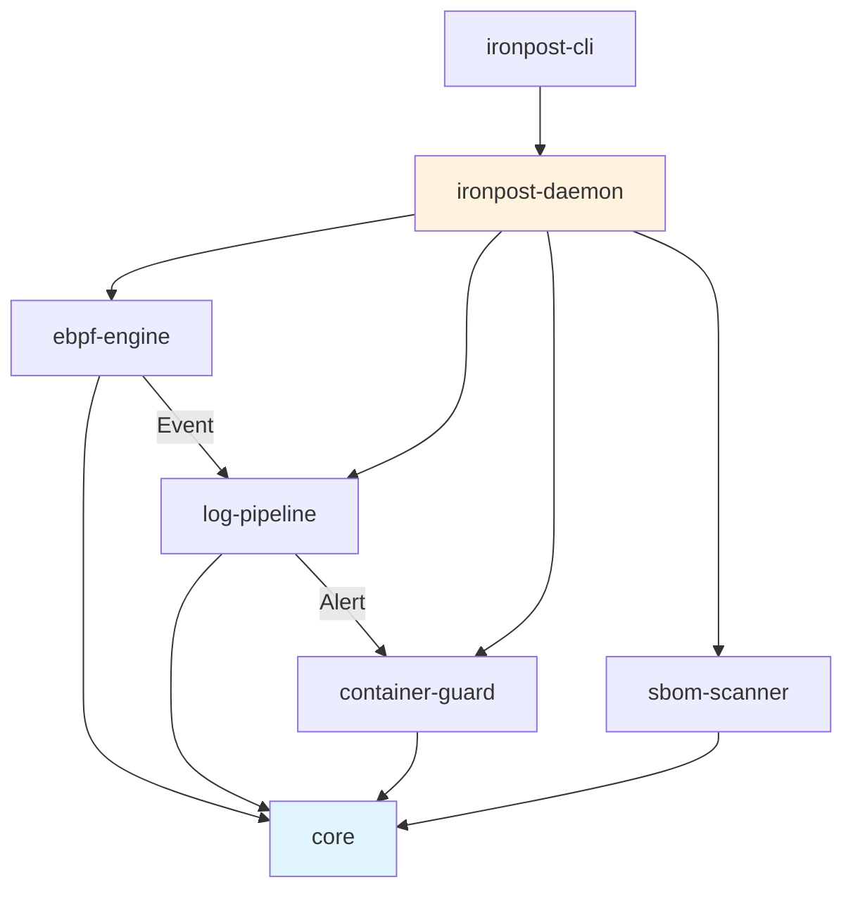

# Ironpost

Rust 기반 통합 보안 모니터링 플랫폼 — eBPF 네트워크 탐지, 로그 분석, 컨테이너 격리, SBOM 스캔을 하나로.

## 아키텍처



## 모듈 구성

| 크레이트 | 경로 | 설명 |
|---------|------|------|
| `ironpost-core` | `crates/core` | 공통 타입, trait, 에러, 설정 |
| `ironpost-ebpf-engine` | `crates/ebpf-engine` | eBPF 기반 네트워크 패킷 탐지 |
| `ironpost-log-pipeline` | `crates/log-pipeline` | 로그 수집·파싱·분석·저장 파이프라인 |
| `ironpost-container-guard` | `crates/container-guard` | 컨테이너 모니터링 및 정책 기반 격리 |
| `ironpost-sbom-scanner` | `crates/sbom-scanner` | SBOM 생성 및 취약점 스캔 |

## 기술 스택

| 영역 | 기술 |
|------|------|
| 언어 | Rust 2024 Edition |
| 비동기 런타임 | Tokio (multi-thread) |
| eBPF | Aya framework |
| 로그 파싱 | nom (파서 컴비네이터) |
| 컨테이너 | bollard (Docker API) |
| 저장소 | PostgreSQL + Redis |
| CLI | clap v4 |
| 모니터링 | Prometheus + Grafana |

## 빠른 시작

```bash
# 메인 프로젝트 빌드
cargo build --release

# eBPF 커널 프로그램 빌드 (선택사항)
cargo run -p xtask -- build-ebpf --release

# 데몬 실행
sudo ./target/release/ironpost-daemon --config ironpost.toml

# CLI 사용
./target/release/ironpost-cli --help
```

> 상세 내용은 [docs/getting-started.md](docs/getting-started.md) 참조

## 문서

- [시스템 아키텍처](docs/architecture.md)
- [모듈별 상세 설명](docs/module-guide.md)
- [빌드 및 실행 가이드](docs/getting-started.md)
- [설계 의사결정 기록](docs/design-decisions.md)
- [성능 벤치마크](docs/benchmarks.md)

## 라이선스

(TBD)
