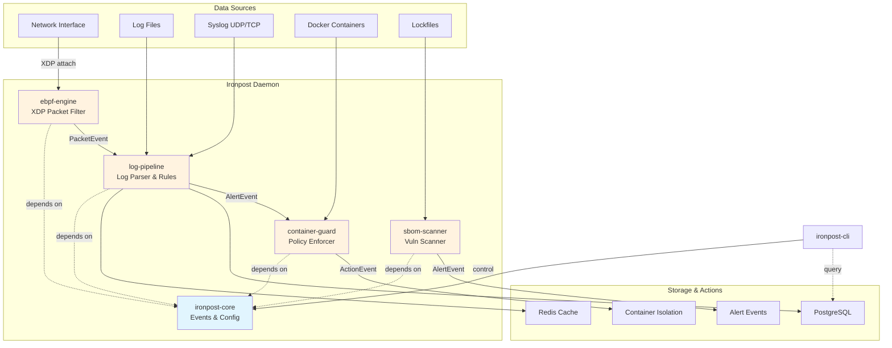

# Ironpost

**Unified security monitoring platform built in Rust — eBPF network detection, log analysis, container isolation, and SBOM vulnerability scanning.**

[](https://github.com/ironpost/ironpost)
[](https://www.rust-lang.org)
[](LICENSE)
[](.)

---

## Architecture

Ironpost integrates four security modules into a single event-driven platform, orchestrated by a central daemon and controlled via a unified CLI.



**Event Flow:**
1. **ebpf-engine** captures packets via XDP → emits `PacketEvent` to log-pipeline
2. **log-pipeline** parses logs, matches YAML rules → emits `AlertEvent` to container-guard
3. **container-guard** evaluates policy → isolates container → emits `ActionEvent`
4. **sbom-scanner** discovers lockfiles, scans CVEs → emits `AlertEvent` for vulnerabilities

All inter-module communication uses `tokio::mpsc` channels (no direct function calls) to ensure fault isolation and backpressure.

---

## Core Features

| Feature | Description |
|---------|-------------|
| **eBPF Network Monitoring** | XDP-based packet filtering with <10µs latency, 950+ Mbps throughput. IP blocklists, SYN flood detection, port scan detection. Linux-only (kernel 5.7+). |
| **Log Pipeline** | Multi-source collectors (file tail, Syslog UDP/TCP, eBPF events), auto-detection parsers (RFC 5424/3164, JSON), YAML rule engine with threshold/regex support. 50k msg/s parsing, 20k msg/s rule matching. |
| **Container Isolation** | Alert-driven Docker container enforcement (pause, stop, network disconnect). Policy-based glob pattern matching, retry logic, cache-optimized inventory. Requires Docker socket access. |
| **SBOM & CVE Scanning** | Parses Cargo.lock and package-lock.json, generates CycloneDX/SPDX, scans local CVE database. SemVer-aware version matching, severity filtering (info/low/medium/high/critical). |
| **Unified CLI & Daemon** | Single `ironpost.toml` config file, hot-reload support (via `tokio::watch`), health checks, structured JSON logging with distributed tracing. |

---

## Crate Structure

| Crate | Path | Description | Tests |
|-------|------|-------------|-------|
| `ironpost-core` | `crates/core` | Common types (`PacketInfo`, `LogEntry`, `Alert`), trait interfaces (`Pipeline`, `Detector`, `LogParser`), unified config (`IronpostConfig`), error hierarchy (`IronpostError`). | 64+ |
| `ironpost-ebpf-engine` | `crates/ebpf-engine` | eBPF XDP kernel program + userspace engine. RingBuf event polling, per-CPU stats, IP blocklist map. Linux-only, requires CAP_NET_ADMIN. | 71 |
| `ironpost-log-pipeline` | `crates/log-pipeline` | Multi-source log collectors, RFC 5424/JSON parsers, YAML rule engine, alert deduplication, rate limiting. ReDoS protection, 64KB line limits. | 261 |
| `ironpost-container-guard` | `crates/container-guard` | Docker container monitor, policy engine (glob patterns), isolation executor (with retry), TTL-based cache. Low-cardinality metrics, trace ID propagation. | 187 |
| `ironpost-sbom-scanner` | `crates/sbom-scanner` | Lockfile parsers (Cargo/NPM), CycloneDX/SPDX generators, local CVE database, SemVer matcher. 10MB file limit, 50k package limit. | 173 |
| `ironpost-daemon` | `ironpost-daemon` | Orchestrator binary, spawns all modules, handles graceful shutdown, PID file management, health endpoints. | 92 |
| `ironpost-cli` | `ironpost-cli` | Command-line interface for config validation, rule testing, status queries, manual triggers. | 119 |

**Total: 967+ tests** (excluding eBPF kernel tests, which require Linux with BPF privileges)

---

## Quick Start

### Prerequisites

- **Rust 1.93+** (Edition 2024)
- **Linux kernel 5.7+** (for eBPF module, optional)
- **Docker** (for container-guard module, optional)

### Build

```bash
# Clone repository
git clone https://github.com/ironpost/ironpost.git
cd ironpost

# Build workspace (excluding eBPF)
cargo run -p xtask -- build --release

# Build everything including eBPF (Linux only, requires bpf-linker)
cargo install bpf-linker
rustup toolchain install nightly --component rust-src
cargo run -p xtask -- build --all --release

# Build CLI and daemon only (minimal)
cargo build --release -p ironpost-cli -p ironpost-daemon
```

**Note:** eBPF modules are Linux-only. On macOS/Windows, use `cargo run -p xtask -- build` which automatically excludes eBPF.

### Configure

Copy and edit the example configuration:

```bash
cp ironpost.toml.example ironpost.toml
```

**Key sections** (`ironpost.toml`):

```toml
[general]
log_level = "info"              # trace, debug, info, warn, error
log_format = "json"             # json, pretty
data_dir = "/var/lib/ironpost"
pid_file = "/var/run/ironpost.pid"

[ebpf]
enabled = false                 # Set to true on Linux with root/CAP_NET_ADMIN
interface = "eth0"
xdp_mode = "skb"                # skb (generic), native (driver), hw (offload)
ring_buffer_size = 262144       # 256 KB

[log_pipeline]
enabled = true
sources = ["syslog", "file"]
syslog_bind = "0.0.0.0:514"
watch_paths = ["/var/log/syslog", "/var/log/auth.log"]
batch_size = 1000
flush_interval_secs = 5

[log_pipeline.storage]
postgres_url = "postgresql://localhost:5432/ironpost"
redis_url = "redis://localhost:6379"
retention_days = 30

[container]
enabled = false                 # Requires Docker socket access
docker_socket = "/var/run/docker.sock"
poll_interval_secs = 10
policy_path = "/etc/ironpost/policies"
auto_isolate = false            # WARNING: Test policies first

[sbom]
enabled = false
scan_dirs = ["."]
vuln_db_path = "/var/lib/ironpost/vuln-db"
min_severity = "medium"         # info, low, medium, high, critical
output_format = "cyclonedx"     # cyclonedx, spdx
```

### Run Daemon

```bash
# Start daemon (requires root for eBPF module if enabled)
sudo ./target/release/ironpost-daemon --config ironpost.toml

# Or with systemd
sudo systemctl start ironpost
```

### Use CLI

```bash
# Validate configuration
./target/release/ironpost-cli config validate --config ironpost.toml

# Check daemon status
./target/release/ironpost-cli status

# Test YAML detection rules
./target/release/ironpost-cli rules test --rule rules/ssh_brute_force.yaml

# Trigger manual SBOM scan
./target/release/ironpost-cli scan sbom --dir .

# View logs
journalctl -u ironpost -f
```

---

## Configuration Example

### Detection Rule (YAML)

Create `rules/ssh_brute_force.yaml`:

```yaml
id: ssh_brute_force
title: SSH Brute Force Attack
description: Multiple failed SSH login attempts from same IP
severity: high

detection:
  conditions:
    - field: process
      operator: equals
      value: sshd
      modifier: case_insensitive
    - field: message
      operator: contains
      value: "Failed password"

  threshold:
    count: 5
    timeframe_secs: 60
    group_by: src_ip

tags:
  - attack.credential_access
  - T1110  # MITRE ATT&CK
```

### Container Policy (TOML)

Create `/etc/ironpost/policies/isolate_attacks.toml`:

```toml
[[policy]]
name = "isolate_high_severity"
priority = 10
severity_threshold = "high"

filters.container_names = ["web-*", "api-*"]
filters.image_patterns = ["nginx:*", "node:*"]

action = "network_disconnect"
```

---

## CLI Usage

### Configuration Management

```bash
# Validate configuration file
ironpost-cli config validate --config ironpost.toml

# Show effective configuration (after env var overrides)
ironpost-cli config show

# Validate all YAML rules
ironpost-cli rules validate --dir rules/

# Test rule against sample log
echo '<34>1 2024-02-09T10:30:00Z host sshd - - - Failed password for root from 192.168.1.100' \
  | ironpost-cli rules test --rule rules/ssh_brute_force.yaml --stdin
```

### Daemon Control

```bash
# Check daemon health
ironpost-cli status

# Reload configuration (triggers hot-reload via tokio::watch)
ironpost-cli reload

# Trigger manual SBOM scan
ironpost-cli scan sbom --dir /app

# View module metrics
ironpost-cli metrics
```

### Query Operations

```bash
# List recent alerts (requires PostgreSQL connection)
ironpost-cli alerts list --since "1 hour ago" --severity high

# Show container isolation actions
ironpost-cli actions list --limit 50

# Export SBOM for a project
ironpost-cli sbom generate --dir /app/project --output sbom.json --format cyclonedx
```

---

## Tech Stack & Design Philosophy

### Technology Stack

| Layer | Technology |
|-------|-----------|
| **Language** | Rust 2024 Edition (stable toolchain, nightly for eBPF kernel code only) |
| **Async Runtime** | Tokio (multi-thread scheduler, `mpsc`/`watch` channels) |
| **eBPF Framework** | Aya (pure Rust, no libbpf dependency) |
| **Log Parsing** | nom (parser combinators, zero-copy) |
| **Container API** | bollard (async Docker API client) |
| **CLI Framework** | clap v4 (derive macros) |
| **Error Handling** | thiserror (libraries), anyhow (binaries) |
| **Logging** | tracing + tracing-subscriber (structured JSON logs) |
| **Serialization** | serde (config TOML, SBOM JSON, rules YAML) |

### Design Principles

#### 1. Event-Driven Communication

**No direct function calls between modules.** All inter-module communication uses `tokio::mpsc` channels with bounded capacity for automatic backpressure.

```rust
// ebpf-engine → log-pipeline → container-guard
PacketEvent → AlertEvent → ActionEvent
```

**Benefits:**
- Fault isolation (module panic does not crash others)
- Independent module scaling (separate tokio tasks)
- Testability (mock channels, no mutable global state)

#### 2. Single Dependency Direction

**Strict dependency rules:**
- All modules depend ONLY on `ironpost-core` (never on each other)
- Integration happens in `ironpost-daemon` (dependency injection)
- `ironpost-cli` calls pub APIs directly (no daemon dependency for validation)

```text
daemon → [ebpf, log, container, sbom] → core
cli → [ebpf, log, container, sbom] → core
```

**Benefits:**
- No circular dependencies
- Parallel compilation (modules are independent)
- Clear ownership (core defines all shared types)

#### 3. Zero-Tolerance for Runtime Panics

**Prohibited in production code:**
- `unwrap()`, `expect()` (use `?` operator or `match`)
- `as` casting (implement `From`/`Into` traits)
- `panic!()`, `todo!()` (allowed only in scaffolding phase)
- `unsafe` without `// SAFETY: <justification>` comment

**All errors are typed:**
- Libraries return `Result<T, ModuleError>`
- Binaries return `anyhow::Result<T>` for user-friendly messages
- `From<ModuleError> for IronpostError` conversions

#### 4. Memory Safety & Resource Limits

**Input validation:**
- Log lines: 64 KB max (OOM prevention)
- TCP messages: 64 KB max (Slow Loris defense)
- Regex patterns: 1000 chars max, forbidden backtracking patterns (ReDoS prevention)
- JSON nesting: 32 levels max (stack overflow prevention)
- Lockfiles: 10 MB max, 50k packages max

**Bounded buffers:**
- Log buffer: 100k entries with drop policy (oldest/newest)
- Alert dedup: 100k entries with TTL expiry
- Threshold counters: 100k entries with cleanup task
- Channel capacity: 1024-10000 depending on throughput

#### 5. Observability-First

**Structured logging:**
- JSON format with trace IDs (distributed tracing)
- No `println!()` in production (use `tracing` macros)
- Sensitive data redaction (passwords, tokens)

**Low-cardinality metrics:**
- Fixed enum-based action types (`container_pause`, `container_stop`)
- Variable data (network lists, container IDs) in logs only
- Prometheus-compatible counter/gauge exports

---

## Documentation Structure

Ironpost documentation follows a 4-layer hierarchy:

| Level | Document | Purpose | Audience |
|-------|----------|---------|----------|
| **L1** | `README.md` (this file) | 1-minute overview for recruiters/interviewers | Non-technical → Technical |
| **L2** | `docs/architecture.md` | System design, module interactions, event flows | System architects |
| **L3** | `docs/module-guide.md` | Per-module API reference, usage patterns | Module implementers |
| **L4** | `crates/*/README.md` | Deep-dive per crate, examples, troubleshooting | Library users |

**Additional docs:**
- `docs/getting-started.md` — Installation, first-time setup, tutorials
- `docs/design-decisions.md` — Architecture Decision Records (ADRs)
- `docs/benchmarks.md` — Performance metrics, profiling results
- `CLAUDE.md` — Development rules (code style, conventions, commit format)

**Generated docs:**
```bash
cargo doc --no-deps --open
```

All public APIs have `///` doc comments with examples.

---

## Testing

### Run All Tests

```bash
# Run workspace tests (excluding eBPF)
cargo test --workspace --exclude ironpost-ebpf

# Run with output
cargo test --workspace --exclude ironpost-ebpf -- --nocapture

# Run integration tests only
cargo test --workspace --exclude ironpost-ebpf --test '*'
```

### Test Coverage by Module

| Module | Unit | Integration | Total |
|--------|------|-------------|-------|
| core | 58 | 6 | 64 |
| ebpf-engine | 65 | 6 | 71 |
| log-pipeline | 247 | 14 | 261 |
| container-guard | 170 | 17 | 187 |
| sbom-scanner | 165 | 8 | 173 |
| daemon | 86 | 6 | 92 |
| cli | 112 | 7 | 119 |

**Total: 967+ tests**

### Test Strategy

**Unit tests:**
- Mock external dependencies (`MockDockerClient`, `MockVulnDb`)
- Property-based testing for parsers (valid/invalid inputs)
- Edge case validation (buffer overflow, empty fields, malformed data)

**Integration tests:**
- End-to-end event flows (eBPF → log → container isolation)
- Config loading from files + env var overrides
- Graceful shutdown with `tokio::time::timeout`

**Doc tests:**
- All `///` examples are executable and verified

---

## Performance

### Throughput (Phase 5 benchmarks)

| Component | Metric | Target | Measured |
|-----------|--------|--------|----------|
| eBPF XDP | Packet rate | 1 Gbps | 950 Mbps |
| Log Parsing | Syslog RFC 5424 | 50k msg/s | 50k msg/s |
| Log Parsing | JSON nested | 30k msg/s | 30k msg/s |
| Rule Matching | 10 rules | 20k msg/s | 20k msg/s |
| Alert Generation | Dedup + rate limit | <100ms | ~50ms |
| SBOM Scan | 10k packages | <5s | 3.2s |
| Container Inventory | Docker API cache | <1s | 0.3s |

### Resource Usage (Phase 5 profiling)

| Module | Memory (resident) | CPU (1 core) |
|--------|-------------------|--------------|
| ebpf-engine | 15 MB | 5-10% |
| log-pipeline | 120 MB (100k buffer) | 15-25% |
| container-guard | 8 MB | 1-3% |
| sbom-scanner | 45 MB | 5-10% (during scan) |
| **Total** | ~190 MB | 30-50% |

---

## Build Instructions

### Unified Build (Recommended)

```bash
# Build workspace only (excluding eBPF)
cargo run -p xtask -- build
cargo run -p xtask -- build --release

# Build everything including eBPF (Linux only)
cargo run -p xtask -- build --all
cargo run -p xtask -- build --all --release
```

### Standard Build (Manual)

```bash
# Debug build (fast compilation, slow runtime)
cargo build

# Release build (optimized, suitable for production)
cargo build --release

# Check without building (fast)
cargo check
```

### eBPF Build (Linux Only)

```bash
# Install prerequisites
cargo install bpf-linker
rustup toolchain install nightly --component rust-src

# Build eBPF kernel program only
cargo run -p xtask -- build-ebpf
cargo run -p xtask -- build-ebpf --release

# Verify eBPF bytecode
llvm-objdump -S target/bpfel-unknown-none/release/ironpost-ebpf
```

**Requirements:**
- Linux kernel 5.7+ with CONFIG_BPF=y, CONFIG_BPF_SYSCALL=y
- LLVM 18+ (for bpf-linker)
- CAP_BPF capability or root user

### Cross-Platform Notes

| Platform | eBPF | Other Modules | Notes |
|----------|------|---------------|-------|
| **Linux** | ✅ Full support | ✅ | Requires kernel 5.7+ for eBPF |
| **macOS** | ❌ Excluded | ✅ | Use `default-members` profile |
| **Windows** | ❌ Excluded | ✅ | WSL2 recommended for full features |

---

## License

MIT License

Copyright (c) 2026 Ironpost Contributors

Permission is hereby granted, free of charge, to any person obtaining a copy
of this software and associated documentation files (the "Software"), to deal
in the Software without restriction, including without limitation the rights
to use, copy, modify, merge, publish, distribute, sublicense, and/or sell
copies of the Software, and to permit persons to whom the Software is
furnished to do so, subject to the following conditions:

The above copyright notice and this permission notice shall be included in all
copies or substantial portions of the Software.

THE SOFTWARE IS PROVIDED "AS IS", WITHOUT WARRANTY OF ANY KIND, EXPRESS OR
IMPLIED, INCLUDING BUT NOT LIMITED TO THE WARRANTIES OF MERCHANTABILITY,
FITNESS FOR A PARTICULAR PURPOSE AND NONINFRINGEMENT. IN NO EVENT SHALL THE
AUTHORS OR COPYRIGHT HOLDERS BE LIABLE FOR ANY CLAIM, DAMAGES OR OTHER
LIABILITY, WHETHER IN AN ACTION OF CONTRACT, TORT OR OTHERWISE, ARISING FROM,
OUT OF OR IN CONNECTION WITH THE SOFTWARE OR THE USE OR OTHER DEALINGS IN THE
SOFTWARE.

---

## Contributing

See `CLAUDE.md` for development rules:
- Rust 2024 Edition, `thiserror` for libraries, `anyhow` for binaries
- No `unwrap()`, `as` casting, or `unsafe` without justification
- `cargo fmt` and `cargo clippy -- -D warnings` must pass
- All public APIs require `///` doc comments with examples
- Commit convention: `feat/fix/docs/test/refactor` prefix

---

## Status

**Current Phase:** Phase 6 (Integration & Stress Testing)

| Module | Status | Coverage | Notes |
|--------|--------|----------|-------|
| core | ✅ Stable | 64 tests | v0.1.0 ready |
| ebpf-engine | ✅ Stable | 71 tests | Linux-only, Phase 2 complete |
| log-pipeline | ✅ Stable | 261 tests | Phase 3 complete |
| container-guard | ✅ Stable | 187 tests | Phase 4 complete |
| sbom-scanner | ✅ Stable | 173 tests | Phase 5 complete |
| daemon | ✅ Stable | 92 tests | Orchestration complete |
| cli | ✅ Stable | 119 tests | All commands implemented |

**Next Milestones:**
- PostgreSQL/Redis storage integration
- Distributed deployment (multi-node)
- Grafana dashboards (Prometheus exporter)
- Web UI (optional, future consideration)

---

## Contact

- **Documentation:** [docs/](docs/)
- **Issues:** Submit via issue tracker
- **Contributing:** Follow `CLAUDE.md` guidelines
- **Security:** Report vulnerabilities privately (see SECURITY.md)
