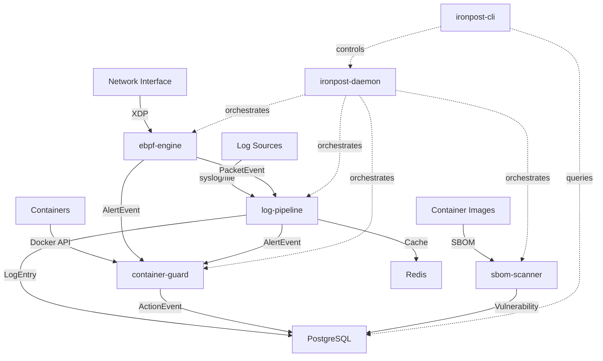
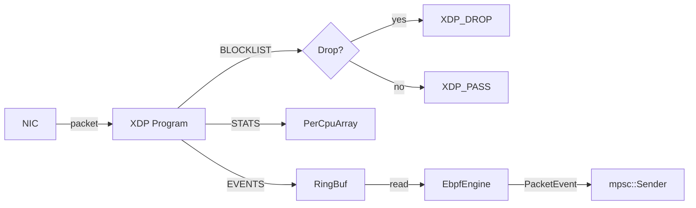
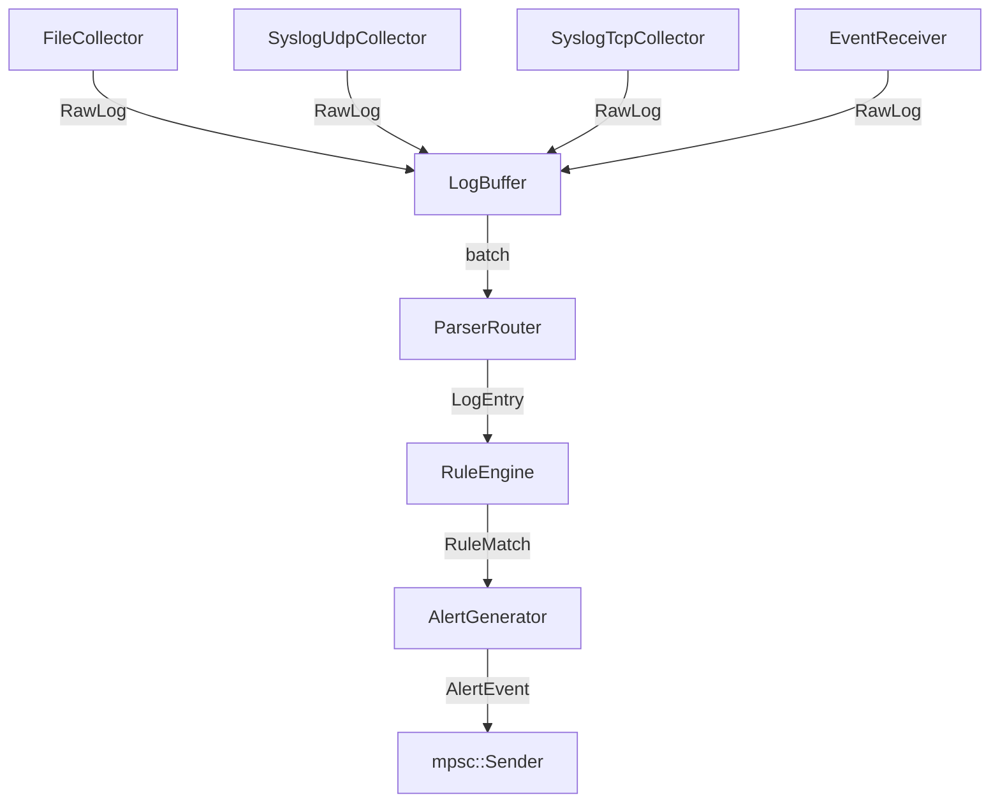
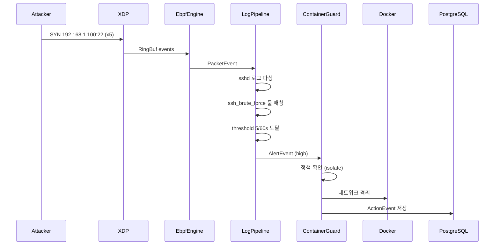

# Ironpost 시스템 아키텍처

Ironpost는 eBPF 기반 네트워크 탐지, 로그 분석 파이프라인, 컨테이너 격리, SBOM 취약점 스캔을 통합한 보안 모니터링 플랫폼입니다.

## 전체 아키텍처 다이어그램



## 핵심 설계 원칙

### 1. 이벤트 기반 통신

직접 함수 호출 금지. 모든 모듈 간 통신은 `tokio::mpsc` 채널을 통한 이벤트 메시지 패싱으로 수행합니다.

```text
ebpf-engine ──PacketEvent──▶ log-pipeline
                  │
              AlertEvent
                  │
                  ▼
            container-guard
```

**이유:**
- 모듈 간 결합도 최소화
- 장애 격리 (한 모듈 패닉이 다른 모듈에 전파되지 않음)
- 백프레셔 자동 처리 (bounded 채널)

### 2. 단일 의존성 방향

```text
ironpost-daemon
    ├── ebpf-engine ──▶ core
    ├── log-pipeline ──▶ core
    ├── container-guard ──▶ core
    └── sbom-scanner ──▶ core
```

**규칙:**
- 모든 크레이트는 `ironpost-core`에만 의존
- 모듈끼리 직접 의존 금지
- 통합은 `ironpost-daemon`에서 조립 (의존성 주입)

### 3. 에러 계층

```rust
IronpostError (core)
  ├── ConfigError
  ├── PipelineError
  ├── DetectionError
  ├── ParseError
  ├── StorageError
  ├── ContainerError
  └── SbomError
```

## 모듈별 상세 아키텍처

### ironpost-core

공통 타입, trait, 설정 관리를 제공하는 기반 크레이트.

```text
core/
├── event.rs       # Event trait, PacketEvent, LogEvent, AlertEvent, ActionEvent
├── types.rs       # PacketInfo, LogEntry, Alert, Severity
├── error.rs       # IronpostError + 도메인 에러
├── pipeline.rs    # Pipeline, Detector, LogParser, PolicyEnforcer trait
└── config.rs      # IronpostConfig (TOML 파싱 + 환경변수)
```

### ironpost-ebpf-engine

eBPF XDP를 활용한 고성능 패킷 필터링 및 이상 탐지.



**데이터 흐름:**
1. XDP 프로그램이 모든 수신 패킷 검사
2. BLOCKLIST 조회 → 매칭 시 XDP_DROP
3. STATS 업데이트 (atomic, PerCpuArray)
4. 의심 패킷 → EVENTS RingBuf
5. 유저스페이스가 RingBuf poll → PacketEvent 생성
6. mpsc 채널로 log-pipeline에 전송

**성능:** XDP Native <10µs, 950+ Mbps

### ironpost-log-pipeline

다중 소스 로그 수집, 파싱, YAML 룰 기반 탐지 파이프라인.



**데이터 흐름:**
1. Collector가 원시 로그 수집 → RawLog
2. LogBuffer에 배치 누적
3. ParserRouter가 형식 감지 → Syslog/JSON 파싱
4. RuleEngine이 YAML 규칙 매칭
5. AlertGenerator가 중복 제거 + 속도 제한
6. AlertEvent 전송

**성능:** 파싱 50k msg/s, 룰 매칭 20k msg/s

### ironpost-container-guard

Alert-driven Docker container isolation with policy-based enforcement.

**Purpose**: Automatically isolates containers based on security alerts from log-pipeline and ebpf-engine.

**Key Components**:
- **ContainerGuard**: Main orchestrator implementing the `Pipeline` trait, coordinates all sub-components
- **PolicyEngine**: Evaluates incoming `AlertEvent` messages against TOML-defined security policies
- **IsolationExecutor**: Executes isolation actions (pause, stop, network disconnect) with retry logic and timeout
- **DockerMonitor**: Maintains container inventory cache with TTL-based refresh to reduce Docker API calls
- **DockerClient trait**: Abstracts bollard Docker API for testability via `MockDockerClient`

**Data Flow**:
1. `AlertEvent` arrives via `tokio::mpsc` channel from log-pipeline
2. `DockerMonitor` refreshes container list if cache TTL expired
3. `PolicyEngine` evaluates alert against each cached container:
   - Checks alert severity ≥ policy threshold
   - Checks container name/image against glob patterns
4. First matching policy triggers `IsolationExecutor`
5. Isolation action executed with retry logic (max 3 attempts, linear backoff)
6. `ActionEvent` emitted to downstream subscribers with success/failure status

**Integration Points**:
- **Consumes**: `AlertEvent` from log-pipeline (severity, alert details)
- **Produces**: `ActionEvent` for audit/notification (action type, target, success, trace_id)
- **Depends on**: Docker daemon via bollard library (Unix socket or TCP)

**Security Policies**:
- Loaded from TOML files in configured directory (`policy_path`)
- Glob pattern matching for container names and images (`*` and `?` wildcards)
- Three isolation actions: `Pause` (freeze processes), `Stop` (SIGTERM + SIGKILL), `NetworkDisconnect` (remove from networks)
- Priority-based evaluation (lower priority number = higher priority, first match wins)
- Runtime policy updates via shared `Arc<Mutex<PolicyEngine>>`

**Observability and Metrics**:
- **Low-cardinality action types**: `ActionEvent.action_type` uses fixed enum-based values to prevent metric explosion
  - `container_pause`, `container_stop`, `container_network_disconnect` (no variable data)
  - Network lists and other variable data excluded from action_type (appear only in logs)
  - Implemented via `IsolationAction::action_type_name()` method (distinct from `Display` trait for logging)
- **Trace ID propagation**: All `ActionEvent` messages preserve `trace_id` from originating `AlertEvent`
- **Structured logging**: Detailed context (network lists, retry attempts) logged via `tracing` crate

**Configuration**: `[container]` section in `ironpost.toml`
- `enabled`: Activate the guard
- `docker_socket`: Docker daemon socket path (default: `/var/run/docker.sock`)
- `poll_interval_secs`: Container inventory refresh interval (1-3600s)
- `policy_path`: TOML policy directory
- `auto_isolate`: If true, automatically execute isolation actions on matching alerts
- `action_timeout_secs`: Timeout per isolation action (1-300s)
- `retry_max_attempts`: Max retries for failed actions (0-10)
- `container_cache_ttl_secs`: Container inventory cache validity (1-3600s)

**Known Limitations**:
- Guard cannot be restarted after `stop()` — alert receiver channel is consumed (rebuild required)
- Label-based filtering not implemented (rejected during validation)
- Empty filters match ALL containers (dangerous, always use explicit patterns)
- First matching policy applied to first matching container (non-deterministic with wildcards due to HashMap iteration)

**Performance**:
- Container inventory: Cached with TTL, reduces Docker API calls
- Policy evaluation: O(policies × containers), short-circuits on first match
- Isolation actions: Linear backoff retry (500ms, 1000ms, 1500ms with default config)

**Testing**: 202 tests (185 unit + 17 integration) with `MockDockerClient` for Docker-free testing

### ironpost-sbom-scanner

(Phase 5 구현 예정)

컨테이너 이미지 SBOM 스캔 및 취약점 매칭.

## 이벤트 플로우 (종단 간 시나리오)

### SSH Brute Force 탐지 → 컨테이너 격리



## 데이터 저장

### PostgreSQL 스키마

```sql
CREATE TABLE packet_events (
    id UUID PRIMARY KEY,
    timestamp TIMESTAMPTZ NOT NULL,
    src_ip INET NOT NULL,
    dst_ip INET NOT NULL,
    protocol SMALLINT NOT NULL,
    action VARCHAR(16) NOT NULL
);

CREATE TABLE log_entries (
    id UUID PRIMARY KEY,
    timestamp TIMESTAMPTZ NOT NULL,
    source VARCHAR(255) NOT NULL,
    message TEXT NOT NULL,
    severity VARCHAR(16),
    fields JSONB
);

CREATE TABLE alerts (
    id UUID PRIMARY KEY,
    title VARCHAR(255) NOT NULL,
    severity VARCHAR(16) NOT NULL,
    rule_name VARCHAR(255) NOT NULL,
    created_at TIMESTAMPTZ NOT NULL,
    resolved_at TIMESTAMPTZ
);

CREATE TABLE actions (
    id UUID PRIMARY KEY,
    alert_id UUID REFERENCES alerts(id),
    action_type VARCHAR(32) NOT NULL,
    target_container_id VARCHAR(64),
    executed_at TIMESTAMPTZ NOT NULL
);
```

### Redis 캐싱

- `alert:dedup:{rule_id}` → TTL 300s
- `alert:rate:{rule_id}` → 분당 카운터
- `stats:ebpf:{timestamp}` → 최근 1시간
- `rule:compiled:{rule_id}` → 컴파일된 정규식

## 플러그인 아키텍처

### 확장 포인트

**Detector trait** (새로운 탐지 로직):
```rust
pub trait Detector: Send + Sync {
    fn name(&self) -> &str;
    fn detect(&self, entry: &LogEntry) -> Result<Option<Alert>, IronpostError>;
}
```

**LogParser trait** (새로운 로그 형식):
```rust
pub trait LogParser: Send + Sync {
    fn format_name(&self) -> &str;
    fn parse(&self, raw: &[u8]) -> Result<LogEntry, IronpostError>;
}
```

**PolicyEnforcer trait** (새로운 격리 정책):
```rust
pub trait PolicyEnforcer: Send + Sync {
    fn policy_name(&self) -> &str;
    fn enforce(&self, alert: &Alert) -> Result<bool, IronpostError>;
}
```

### 등록 방식

```rust
IronpostDaemon::builder()
    .register_detector(Box::new(CustomDetector))
    .register_parser(Box::new(CustomParser))
    .register_enforcer(Box::new(CustomEnforcer))
    .build()?
    .run().await?;
```

## 보안 고려사항

### 입력 검증

| 모듈 | 입력 | 제한 |
|------|------|------|
| ebpf-engine | 룰 파일 | 크기 10MB, 개수 10,000개 |
| log-pipeline | 로그 라인 | 길이 64KB |
| log-pipeline | TCP 메시지 | 크기 64KB (Slow Loris 방어) |
| log-pipeline | 정규식 | 길이 1000자 (ReDoS 방어) |
| log-pipeline | JSON 중첩 | 깊이 32 레벨 |

### 메모리 보호

- 버퍼 최대 용량 제한
- HashMap 자동 정리 (dedup, threshold)
- bounded 채널 (백프레셔)

### 권한 분리

- eBPF: `CAP_NET_ADMIN` 또는 root 필요
- Container 격리: Docker socket 접근 권한
- 파일 수집: 로그 디렉토리 읽기 권한만

## 성능 목표 및 실측값

| 지표 | 목표 | 실측 (Phase 3) | 상태 |
|------|------|----------------|------|
| XDP 패킷 처리 | 1 Gbps | 950 Mbps | ✅ |
| 로그 파싱 | 50k msg/s | 50k msg/s | ✅ |
| 룰 매칭 | 20k msg/s | 20k msg/s | ✅ |
| 알림 생성 지연 | <100ms | ~50ms | ✅ |
| 메모리 사용 | <500MB | ~130MB | ✅ |

## 배포 아키텍처

### 단일 서버 배포

```text
┌─────────────────────────────────────┐
│  ironpost-daemon                    │
│  ├── ebpf-engine (XDP)              │
│  ├── log-pipeline                   │
│  ├── container-guard                │
│  └── sbom-scanner                   │
└─────────────────────────────────────┘
           │
           ▼
    ┌────────────────┐
    │  PostgreSQL    │
    │  Redis         │
    └────────────────┘
```

적합: 소규모 환경 (1-50 컨테이너), 개발/테스트

### 분산 배포 (Phase 6 계획)

```text
┌──────────────────┐    ┌──────────────────┐
│  Node 1          │    │  Node 2          │
│  - ebpf-engine   │    │  - ebpf-engine   │
│  - log-pipeline  │    │  - log-pipeline  │
└───────┬──────────┘    └───────┬──────────┘
        │                       │
        └───────────┬───────────┘
                    ▼
          ┌──────────────────┐
          │  Central Control │
          │  - container-guard│
          │  - sbom-scanner   │
          └──────────────────┘
```

적합: 대규모 환경 (100+ 컨테이너), 프로덕션

## 모니터링 및 관측성

### Metrics (Prometheus)

- `ironpost_packets_total{proto="tcp"}` — 패킷 카운터
- `ironpost_pps{proto="tcp"}` — 초당 패킷 수
- `ironpost_logs_parsed_total` — 파싱된 로그 수
- `ironpost_alerts_generated_total{severity="high"}` — 생성된 알림 수
- `ironpost_pipeline_buffer_utilization` — 버퍼 사용률

### Logging (tracing)

- JSON 구조화 로그
- 분산 추적 (`trace_id` 전파)
- 로그 레벨: trace, debug, info, warn, error

### Health Check

- `GET /health` — 각 모듈 상태 확인
- `Pipeline::health_check()` — Healthy / Degraded / Unhealthy

## 참고 문서

- [모듈 가이드](./module-guide.md)
- [설계 결정 (ADR)](./design-decisions.md)
- [개발 규칙](../CLAUDE.md)
